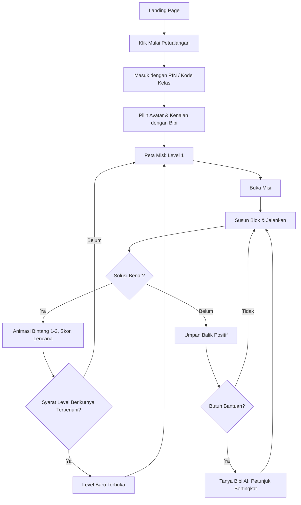

# Product Requirements Document (PRD): CodeKids

| Atribut | Detail |
| --- | --- |
| **Produk** | CodeKids, platform web edukasi coding dasar berbasis AI untuk anak SD |
| **Konteks** | M-ONE Telkomsel Coding Competition, tema *Web Education for Kids* |
| **Versi / Status** | v1.0, Draft untuk review |
| **Tech Stack** | Next.js (App Router), Tailwind CSS, Gemini API |
| **Target MVP** | 3 level misi, Tanya Bibi AI, Dashboard Orang Tua/Guru |

---

## 1. Executive Summary & Visi Produk

### 1.1 Ringkasan

CodeKids adalah aplikasi web yang memperkenalkan *computational thinking* kepada anak SD (7–12 tahun) melalui misi bergaya permainan. Anak belajar tiga konsep dasar pemrograman, yaitu **Sequencing**, **Looping**, dan **Conditional (IF-ELSE)**, lewat petualangan visual yang dikaitkan dengan materi Matematika dan IPA. Tutor virtual **"Tanya Bibi AI"** mendampingi dengan analogi sederhana dan petunjuk bertahap, bukan jawaban langsung. Orang tua dan guru memantau perkembangan melalui dashboard khusus.

### 1.2 Visi

> Menjadikan setiap anak Indonesia percaya diri berpikir logis dan terstruktur sejak SD, lewat belajar coding yang menyenangkan, aman, dan terarah.

### 1.3 Tujuan Produk

1. Memperkenalkan tiga konsep dasar coding secara bertahap dan menyenangkan.
2. Memperkuat pemahaman materi SD (Matematika/IPA) lewat konteks misi.
3. Memberi pendampingan personal ala tutor tanpa membocorkan jawaban.
4. Memberi guru dan orang tua visibilitas progres belajar anak.

### 1.4 Ruang Lingkup

**In scope (MVP):** landing page, autentikasi dan profil anak, 3 level misi (minimal 5 misi per level), Tanya Bibi AI, sistem bintang/skor/lencana, dashboard orang tua/guru, desain responsif.

**Out of scope (pasca-MVP):** mode multiplayer, editor kode teks (Python/JS), pembayaran/langganan, aplikasi native, bank soal sekolah terintegrasi.

---

## 2. Target Pengguna & Problem Statement

### 2.1 Segmentasi Pengguna

| Segmen | Peran | Kebutuhan Utama |
| --- | --- | --- |
| **Anak SD (7–12 th)** | Pengguna utama | Belajar yang seru, instruksi sederhana, umpan balik instan, rasa berhasil |
| **Orang tua** | Pemantau | Mengetahui progres, aman dari konten tidak pantas, kontrol waktu belajar |
| **Guru SD** | Pemantau & fasilitator | Memantau banyak siswa, mengaitkan dengan kurikulum, laporan ringkas |

### 2.2 Problem Statement

1. **Coding terasa abstrak dan menakutkan** bagi anak. Banyak platform memakai bahasa teknis dan antarmuka yang dirancang untuk remaja atau dewasa.
2. **Kurangnya pendamping.** Banyak orang tua dan guru SD tidak punya latar belakang pemrograman, sehingga anak yang buntu cenderung menyerah.
3. **Jawaban instan merusak proses belajar.** Anak yang langsung diberi solusi tidak membangun logika sendiri.
4. **Kurang keterkaitan dengan pelajaran sekolah.** Coding dianggap pelajaran terpisah, bukan alat bantu berpikir.
5. **Pemantauan terbatas.** Orang tua dan guru sulit melihat capaian konkret, bukan sekadar waktu layar.

### 2.3 Value Proposition

*"Belajar coding sambil bermain, ditemani Bibi AI yang sabar, dan dipantau orang tua dan guru."*

---

## 3. User Persona

### Persona 1: Raka (Anak, 9 tahun, Kelas 4 SD)

- **Latar belakang:** Suka gim, bisa memakai tablet, belum pernah belajar coding. Di sekolah mulai belajar perkalian dan siklus air.
- **Tujuan:** Menyelesaikan misi, mengumpulkan bintang, naik level.
- **Frustrasi:** Teks panjang, istilah sulit, mudah bosan jika terlalu lama stuck.
- **Kebutuhan produk:** Instruksi pendek dengan ikon, karakter ramah, umpan balik langsung, petunjuk yang membimbing.
- **Kutipan:** *"Aku mau jadi yang pertama dapat bintang tiga!"*

### Persona 2: Bu Sari (Guru Kelas, 34 tahun, SD Negeri)

- **Latar belakang:** Mengajar 30 siswa, melek teknologi tingkat dasar, ingin pembelajaran yang inovatif.
- **Tujuan:** Memantau siswa yang tertinggal dan berprestasi, mengaitkan kegiatan dengan Matematika/IPA.
- **Frustrasi:** Waktu terbatas, tidak punya waktu mempelajari tool rumit.
- **Kebutuhan produk:** Dashboard kelas yang ringkas, daftar siswa dengan progres bintang dan skor, penanda siswa yang butuh bantuan.

### Persona 3: Ibu Rina (Orang Tua, 38 tahun, Pekerja Kantoran)

- **Latar belakang:** Anak kelas 3 SD, khawatir soal keamanan internet dan waktu layar.
- **Tujuan:** Memastikan anak belajar hal bermanfaat dan aman.
- **Frustrasi:** Tidak paham coding, sulit menilai apakah anak benar-benar belajar.
- **Kebutuhan produk:** Ringkasan mingguan, indikator konsep yang dikuasai dalam bahasa awam, jaminan keamanan konten AI.

---

## 4. Fitur Utama & Spesifikasi Fungsional (Functional Requirements)

Prioritas memakai skala MoSCoW: **M** (Must), **S** (Should), **C** (Could).

### 4.1 Landing Page Interaktif

**Tujuan:** Menarik perhatian anak, meyakinkan orang tua/guru, dan mengarahkan ke pendaftaran.

**Identitas Visual:**

| Elemen | Spesifikasi |
| --- | --- |
| Warna dasar | Peach/krem (usulan `#FFF1E3`) |
| Heading | Biru dongker (usulan `#1B2A5C`) |
| Tombol CTA | Pill (rounded-full), oranye (usulan `#FF8A2B`), teks putih tebal |
| Tipografi | Font rounded ramah anak (mis. Baloo 2 / Nunito), ukuran besar |

| ID | Kebutuhan | Prioritas |
| --- | --- | --- |
| FR-LP-01 | Hero section: headline, ilustrasi maskot Bibi, dua CTA ("Mulai Petualangan" dan "Untuk Orang Tua/Guru"). | M |
| FR-LP-02 | Section "Cara Belajar": 3 level misi dengan kartu ikon dan animasi hover. | M |
| FR-LP-03 | Section "Kenalan dengan Bibi AI" berisi demo interaktif singkat (contoh percakapan statis atau animasi). | M |
| FR-LP-04 | Section untuk orang tua/guru: cuplikan dashboard dan jaminan keamanan. | M |
| FR-LP-05 | Mikro-interaksi: maskot bergerak, tombol *bounce*, elemen melayang. Wajib menghormati `prefers-reduced-motion`. | S |
| FR-LP-06 | Mini-game demo "coba satu misi" tanpa login untuk menurunkan hambatan masuk. | C |
| FR-LP-07 | Footer: kebijakan privasi, kontak, informasi kompetisi. | M |

### 4.2 Autentikasi & Profil

| ID | Kebutuhan | Prioritas |
| --- | --- | --- |
| FR-AUTH-01 | Orang tua/guru mendaftar dengan email dan kata sandi (atau Google). Anak **tidak** mendaftar dengan data pribadi. | M |
| FR-AUTH-02 | Akun pemantau membuat profil anak berisi nama panggilan, pilihan avatar, dan jenjang kelas (1–6). | M |
| FR-AUTH-03 | Masuk anak lewat PIN 4 digit atau kode kelas dari guru, tanpa email. | M |
| FR-AUTH-04 | Satu akun orang tua dapat mengelola beberapa anak. Satu akun guru dapat mengelola satu atau lebih kelas. | S |
| FR-AUTH-05 | Persetujuan orang tua (*parental consent*) saat pembuatan profil anak. | M |

### 4.3 Sistem Belajar Misi Berjenjang (Gamifikasi)

**Mekanik inti:** Anak menyusun **blok instruksi visual** (drag-and-drop) untuk mengendalikan karakter atau menyelesaikan skenario di papan misi. Tidak ada pengetikan kode pada MVP.

#### Struktur Level

| Level | Konsep | Tema Contoh & Kaitan Kurikulum |
| --- | --- | --- |
| **Level 1: Sequencing** | Urutan langkah | **IPA:** menyusun urutan siklus air atau tumbuh kembang tanaman. **Matematika:** urutan langkah menghitung penjumlahan bersusun. |
| **Level 2: Looping** | Perulangan | **Matematika:** perkalian sebagai penjumlahan berulang ("ulangi 4x tambah 3"), pola bilangan. **IPA:** siklus detak jantung, fase bulan. |
| **Level 3: Kondisional** | IF-ELSE | **Matematika:** "JIKA bilangan genap MAKA ke kotak biru, JIKA TIDAK ke kotak merah". **IPA:** klasifikasi benda "JIKA terapung MAKA ..., JIKA TIDAK ...". |

| ID | Kebutuhan | Prioritas |
| --- | --- | --- |
| FR-MISI-01 | Peta misi (*world map*) per level dengan node misi yang terkunci, terbuka, atau selesai. | M |
| FR-MISI-02 | Minimal 5 misi per level (total ≥ 15), kesulitan naik bertahap. | M |
| FR-MISI-03 | Setiap misi memuat: narasi singkat (maks. 2 kalimat), tujuan, papan permainan, palet blok, tombol "Jalankan". | M |
| FR-MISI-04 | Editor blok drag-and-drop yang mendukung sentuh (touch) dan mouse. | M |
| FR-MISI-05 | Validasi solusi otomatis. Jika salah, tampil umpan balik positif dan tombol "Tanya Bibi". | M |
| FR-MISI-06 | Penilaian 1–3 bintang berdasarkan efisiensi solusi (jumlah blok), jumlah percobaan, dan pemakaian petunjuk. | M |
| FR-MISI-07 | Skor per misi dan total, XP, dan kenaikan "pangkat" (mis. Penjelajah, Petualang, Jagoan Kode). | S |
| FR-MISI-08 | Lencana (*badge*) untuk pencapaian: "Misi Pertama", "Tanpa Petunjuk", "Master Looping". | S |
| FR-MISI-09 | Level berikutnya terbuka setelah ≥ 70% bintang level sebelumnya terkumpul. | M |
| FR-MISI-10 | Animasi dan suara perayaan saat misi selesai (dapat dimatikan). | S |
| FR-MISI-11 | Progres tersimpan otomatis dan dapat dilanjutkan lintas perangkat. | M |
| FR-MISI-12 | Konten misi dikelola sebagai data terstruktur (JSON/CMS) agar mudah ditambah. | S |

### 4.4 Fitur Unggulan AI: "Tanya Bibi AI"

**Deskripsi:** Tutor virtual berkarakter ramah ("Bibi") yang tersedia di setiap misi. Bibi memandu dengan **analogi sehari-hari** dan **petunjuk bertingkat** tanpa langsung memberikan solusi.

**Contoh perilaku yang diharapkan:**

- *Anak:* "Kenapa looping-ku nggak jalan?"
- *Bibi:* "Bayangkan kamu menyiram 5 pot bunga. Apakah kamu menulis 'siram' lima kali, atau bilang 'siram, ulangi 5 kali'? Coba lihat blokmu, sudah ada kata 'ulangi'-nya belum? 🌱"

**Kebutuhan Fungsional**

| ID | Kebutuhan | Prioritas |
| --- | --- | --- |
| FR-AI-01 | Tombol Bibi di setiap misi membuka panel chat yang tidak menutupi papan permainan. | M |
| FR-AI-02 | Bibi menerima konteks misi (ID misi, tujuan, susunan blok saat ini, jumlah percobaan) untuk jawaban relevan. | M |
| FR-AI-03 | **Sistem petunjuk bertingkat:** Tingkat 1 (pertanyaan pemandu), Tingkat 2 (analogi), Tingkat 3 (petunjuk spesifik pada bagian yang salah). Bibi **tidak pernah** memberikan susunan blok jawaban lengkap. | M |
| FR-AI-04 | Jawaban menggunakan bahasa Indonesia sederhana: kalimat pendek (maks. ±3 kalimat), kosakata level SD, emoji secukupnya. | M |
| FR-AI-05 | Opsi pertanyaan cepat berupa tombol (mis. "Aku bingung mulai dari mana", "Jelaskan pakai contoh") untuk anak yang belum lancar mengetik. | S |
| FR-AI-06 | Opsi pembacaan suara (text-to-speech) untuk anak dengan kemampuan baca terbatas. | C |
| FR-AI-07 | Penggunaan petunjuk dicatat dan memengaruhi penilaian bintang secara proporsional. | M |
| FR-AI-08 | Batas penggunaan (*rate limit*) per anak per misi untuk mengendalikan biaya dan mendorong usaha mandiri. | M |
| FR-AI-09 | Riwayat percakapan tersimpan dan dapat dilihat orang tua/guru pada dashboard. | S |

**Guardrail Keamanan AI (Wajib)**

| ID | Kebutuhan |
| --- | --- |
| FR-AI-S1 | *System prompt* menetapkan persona Bibi, batas topik (hanya misi/coding dasar/materi SD terkait), dan larangan membocorkan solusi. |
| FR-AI-S2 | Gunakan pengaturan *safety settings* Gemini pada ambang ketat, ditambah filter input dan output sisi server. |
| FR-AI-S3 | Pertanyaan di luar topik dijawab dengan pengalihan lembut ke misi. |
| FR-AI-S4 | Bibi tidak meminta atau menyimpan data pribadi (nama lengkap, alamat, sekolah). Input yang terdeteksi memuat data pribadi disamarkan. |
| FR-AI-S5 | Pemanggilan Gemini hanya dari server (Route Handler/Server Action). API key tidak boleh terekspos ke klien. |
| FR-AI-S6 | Respons *fallback* ramah ("Bibi lagi istirahat sebentar, coba lagi ya!") jika API gagal atau kena batas kuota. |
| FR-AI-S7 | Pengujian *red-team* sebelum rilis: percobaan *prompt injection*, permintaan jawaban langsung, dan topik tidak pantas. |

### 4.5 Dashboard Orang Tua / Guru

| ID | Kebutuhan | Prioritas |
| --- | --- | --- |
| FR-DASH-01 | **Ringkasan anak:** total bintang, skor, level saat ini, pangkat, waktu belajar mingguan. | M |
| FR-DASH-02 | **Progres per level/misi:** status, bintang, jumlah percobaan, pemakaian petunjuk Bibi. | M |
| FR-DASH-03 | **Peta penguasaan konsep** (Sequencing, Looping, IF-ELSE) dengan indikator sederhana ("Sudah Paham", "Sedang Belajar", "Perlu Bantuan"). | M |
| FR-DASH-04 | Grafik aktivitas harian/mingguan (bintang dan skor dari waktu ke waktu). | S |
| FR-DASH-05 | **Tampilan guru:** daftar siswa per kelas, dapat diurutkan dan disaring, dengan penanda siswa yang tidak aktif atau banyak mengalami kegagalan. | M |
| FR-DASH-06 | Kode kelas dan undangan siswa untuk guru. | M |
| FR-DASH-07 | Riwayat percakapan Bibi dengan ringkasan topik yang ditanyakan. | S |
| FR-DASH-08 | Pengaturan orang tua: batas waktu belajar harian, reset PIN anak, hapus data anak. | S |
| FR-DASH-09 | Ekspor laporan kelas (CSV/PDF) untuk guru. | C |
| FR-DASH-10 | Rekomendasi aktivitas lanjutan di rumah berbasis konsep yang lemah. | C |

### 4.6 Arsitektur Teknis Tingkat Tinggi

| Lapisan | Pilihan & Catatan |
| --- | --- |
| **Frontend** | Next.js (App Router), React Server Components untuk halaman statis (landing), Client Components untuk editor blok dan chat. |
| **Styling** | Tailwind CSS dengan *design tokens* (warna peach, biru dongker, oranye) di `tailwind.config`. |
| **Editor blok** | Pustaka drag-and-drop yang mendukung sentuh (mis. `dnd-kit`) atau Blockly versi ringan. |
| **AI** | Gemini API melalui Route Handler `/api/bibi` (server-side), *streaming* respons, *system prompt* terkelola. |
| **Data & Auth** | Basis data relasional (mis. PostgreSQL/Supabase) dan Auth.js/Supabase Auth. Entitas: User, ChildProfile, Class, Mission, Attempt, Progress, Badge, ChatLog. |
| **Hosting** | Vercel (atau setara) dengan *edge caching* untuk aset statis. |

---

## 5. Non-Functional Requirements

### 5.1 UI/UX

| ID | Kebutuhan |
| --- | --- |
| NFR-UX-01 | Palet: dasar peach/krem, heading biru dongker, CTA pill oranye. Kontras teks memenuhi WCAG AA (≥ 4.5:1). |
| NFR-UX-02 | Target sentuh minimal 48×48 px, jarak antar tombol memadai untuk jari anak. |
| NFR-UX-03 | Teks pendek, ikon dominan, satu tujuan per layar. Ukuran font dasar ≥ 18 px untuk area anak. |
| NFR-UX-04 | Umpan balik selalu positif dan membangun. Tidak ada layar "GAGAL" yang menghukum. |
| NFR-UX-05 | Konsistensi maskot dan nada bahasa Bibi di seluruh produk. |
| NFR-UX-06 | Aksesibilitas: navigasi keyboard, label ARIA, dukungan pembaca layar, opsi mematikan suara dan animasi, tidak mengandalkan warna saja sebagai penanda. |
| NFR-UX-07 | Area anak minim iklan dan tautan keluar. Dashboard dewasa dipisahkan secara visual dan akses. |

### 5.2 Responsivitas & Kompatibilitas

| ID | Kebutuhan |
| --- | --- |
| NFR-RS-01 | Pendekatan *mobile-first*. Titik henti utama: 360 px (ponsel), 768 px (tablet), 1280 px (desktop). |
| NFR-RS-02 | Prioritas perangkat: tablet dan laptop sekolah. Editor blok tetap nyaman dipakai pada layar 768 px. |
| NFR-RS-03 | Browser: dua versi terbaru Chrome, Edge, Safari, Firefox, dan Chrome Android/Safari iOS. |
| NFR-RS-04 | Mendukung orientasi portrait dan landscape. |

### 5.3 Performance

| ID | Kebutuhan | Target |
| --- | --- | --- |
| NFR-PF-01 | Largest Contentful Paint (landing) | ≤ 2,5 detik pada 4G |
| NFR-PF-02 | Interaction to Next Paint | ≤ 200 ms |
| NFR-PF-03 | Cumulative Layout Shift | ≤ 0,1 |
| NFR-PF-04 | Skor Lighthouse (Performance, Accessibility, Best Practices) | ≥ 90 |
| NFR-PF-05 | Respons pertama Bibi (awal streaming) | ≤ 3 detik (p90) |
| NFR-PF-06 | Optimasi aset: `next/image`, format WebP/AVIF, *lazy loading*, *code splitting* untuk editor blok. | – |
| NFR-PF-07 | Ketersediaan layanan | ≥ 99% saat jam belajar |

### 5.4 Keamanan & Privasi

| ID | Kebutuhan |
| --- | --- |
| NFR-SC-01 | Meminimalkan data anak: hanya nama panggilan, avatar, dan jenjang kelas. |
| NFR-SC-02 | Persetujuan orang tua, kebijakan privasi berbahasa sederhana, dan penyesuaian dengan UU Pelindungan Data Pribadi (UU PDP) Indonesia. |
| NFR-SC-03 | HTTPS wajib, hash kata sandi, *role-based access control* (anak, orang tua, guru), proteksi CSRF/XSS. |
| NFR-SC-04 | Hak orang tua untuk mengekspor dan menghapus seluruh data anak. |
| NFR-SC-05 | Variabel lingkungan untuk semua kunci API, tidak ada rahasia di kode klien. |

### 5.5 Skalabilitas & Pemeliharaan

- Konten misi berbasis data agar penambahan misi tidak memerlukan perubahan kode besar.
- *Logging* dan pemantauan galat (mis. Sentry), serta pemantauan biaya dan kuota Gemini.
- Struktur komponen modular dan teruji (unit test untuk logika validasi misi).

---

## 6. User Flow / Alur Pengguna

### 6.1 Flow Anak (Alur Utama)

### 6.2 Flow Orang Tua

1. Landing Page → klik **"Untuk Orang Tua/Guru"**.
2. Daftar akun dan verifikasi email.
3. Buat profil anak, beri persetujuan, dan terima PIN.
4. Anak bermain (di perangkat yang sama atau berbeda).
5. Buka **Dashboard** → lihat ringkasan bintang/skor, penguasaan konsep, dan riwayat Bibi.
6. Atur batas waktu belajar bila perlu.

### 6.3 Flow Guru

1. Daftar sebagai guru → buat kelas → dapatkan **kode kelas**.
2. Bagikan kode ke siswa. Siswa bergabung dengan nama panggilan.
3. Buka **Dashboard Kelas** → daftar siswa, progres, penanda siswa yang butuh bantuan.
4. (Opsional) Ekspor laporan kelas.

### 6.4 Flow Interaksi Tanya Bibi AI

1. Anak mengetuk tombol Bibi → panel chat terbuka dengan konteks misi otomatis.
2. Anak memilih pertanyaan cepat atau mengetik.
3. Server memfilter input → mengirim ke Gemini bersama *system prompt* dan konteks misi.
4. Respons difilter → ditampilkan secara *streaming* sesuai tingkat petunjuk.
5. Penggunaan petunjuk dicatat → memengaruhi bintang → tampil di dashboard.

---

## 7. Metrik Keberhasilan Produk (Success Metrics)

### 7.1 Metrik Utama (North Star)

**Jumlah misi yang diselesaikan per anak aktif per minggu**, yang mencerminkan keterlibatan sekaligus pembelajaran nyata.

### 7.2 Metrik Pendukung

| Kategori | Metrik | Target MVP |
| --- | --- | --- |
| **Aktivasi** | Anak menyelesaikan misi pertama dalam sesi pertama | ≥ 70% |
| **Keterlibatan** | Rata-rata misi selesai per sesi | ≥ 2 |
|  | Rata-rata durasi sesi | 10–20 menit |
| **Retensi** | Retensi anak hari ke-7 | ≥ 35% |
| **Pembelajaran** | Rata-rata bintang per misi | ≥ 2,0 |
|  | Penyelesaian Level 1 → mulai Level 2 | ≥ 60% |
|  | Peningkatan penyelesaian misi tanpa petunjuk antar percobaan | Tren naik |
| **Kualitas AI** | Interaksi Bibi yang tidak membocorkan jawaban lengkap (audit sampel) | ≥ 98% |
|  | Rating "membantu" dari anak (👍/👎) | ≥ 80% |
|  | Pelanggaran keamanan konten | 0 |
| **Pemantau** | Orang tua/guru yang membuka dashboard minimal 1x/minggu | ≥ 50% |
|  | Skor kepuasan dashboard (survei singkat, skala 1–5) | ≥ 4,0 |
| **Teknis** | Lighthouse Performance dan Accessibility | ≥ 90 |
|  | Tingkat galat respons Bibi | \< 2% |
| **Kompetisi** | Demo end-to-end tanpa kendala dan kesesuaian dengan tema *Web Education for Kids* | Tercapai |

### 7.3 Metode Pengukuran

Analitik peristiwa (mis. PostHog/GA4 tanpa data pribadi anak), log percobaan misi, survei singkat orang tua/guru, dan uji kegunaan dengan 5–10 anak SD sebelum penjurian.

---

## Lampiran

### A. Risiko & Mitigasi

| Risiko | Dampak | Mitigasi |
| --- | --- | --- |
| AI membocorkan jawaban atau menjawab di luar konteks | Tinggi | System prompt ketat, petunjuk bertingkat, filter output, red-team testing |
| Kuota/biaya Gemini membengkak | Sedang | Rate limit, caching jawaban umum, tombol pertanyaan cepat |
| Anak kesulitan memakai drag-and-drop di layar kecil | Sedang | Uji pada tablet, target sentuh besar, opsi tap-to-add |
| Isu privasi data anak | Tinggi | Minimalisasi data, persetujuan orang tua, tanpa email anak |
| Waktu pengembangan kompetisi terbatas | Sedang | Prioritas MoSCoW, MVP: 3 level × 5 misi, fitur *Could* ditunda |

### B. Roadmap Ringkas

| Fase | Cakupan |
| --- | --- |
| **Fase 1 (MVP)** | Landing page, auth, Level 1–3, Tanya Bibi AI, dashboard dasar |
| **Fase 2** | Lencana lengkap, grafik, ekspor laporan, text-to-speech, lebih banyak misi |
| **Fase 3** | Mode kelas langsung, editor kode semi-teks, integrasi kurikulum lebih dalam |

### C. Asumsi

- Perangkat anak memiliki koneksi internet yang cukup stabil.
- Kode warna hanyalah usulan dan dapat disesuaikan dengan panduan desain final.
- Kuota Gemini API tersedia selama periode kompetisi.